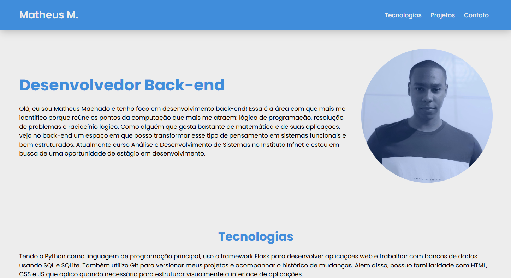

# 💻 Portfólio Pessoal

Este repositório reúne o código-fonte do meu **portfólio web pessoal**, desenvolvido com **HTML**, **CSS** e **JavaScript** para apresentar meu perfil profissional, minhas principais tecnologias e alguns dos projetos que venho construindo ao longo da minha formação em desenvolvimento de software.



## Visualização

[Clique aqui para visualizar o portfólio (Ctrl + clique para abrir em uma nova aba)](https://matheus-machado750.github.io/portfolio/)

O site está disponível online e pode ser acessado diretamente pelo navegador, sem necessidade de instalação ou configuração local.

---

## 📖 Sobre o Projeto

Este portfólio foi desenvolvido com o objetivo de centralizar, em um único ambiente, minha apresentação profissional como estudante e desenvolvedor em formação. A proposta do projeto é oferecer uma navegação simples, visualmente organizada e direta, permitindo que recrutadores, avaliadores técnicos ou visitantes em geral entendam rapidamente quem eu sou, com quais tecnologias trabalho e quais projetos já desenvolvi.

A estrutura da página foi pensada para destacar de forma objetiva os pontos mais importantes do meu perfil, combinando apresentação pessoal, listagem de tecnologias, exibição de projetos e canais de contato em uma interface única e acessível.

---

## Principais Seções

### Início
Seção de apresentação pessoal, com um resumo do meu perfil, área de interesse e objetivo profissional atual na área de desenvolvimento.

### Tecnologias
Área dedicada às principais tecnologias que utilizo, com foco nas ferramentas, linguagens e recursos que fazem parte da minha stack atual.

### Projetos
Seção voltada à exibição dos projetos que desenvolvi, com imagem ilustrativa, descrição resumida e link para o respectivo repositório no GitHub.

### Contato
Espaço destinado aos meus canais de comunicação, reunindo redes profissionais e formulário para envio direto de mensagem por email.

---

## ⚙️ Stack e Tecnologias

- **HTML**: utilizado para estruturar semanticamente o conteúdo da página.
- **CSS**: responsável pela estilização visual e pela organização do layout.
- **JavaScript**: utilizado nas interações da interface, como o menu responsivo e o formulário de contato.
- **GitHub Pages**: utilizado para publicar o portfólio online.

---

## Estrutura do Repositório

```plaintext
portfolio/
├── imagem/
├── index.html
├── style.css
└── script.js
